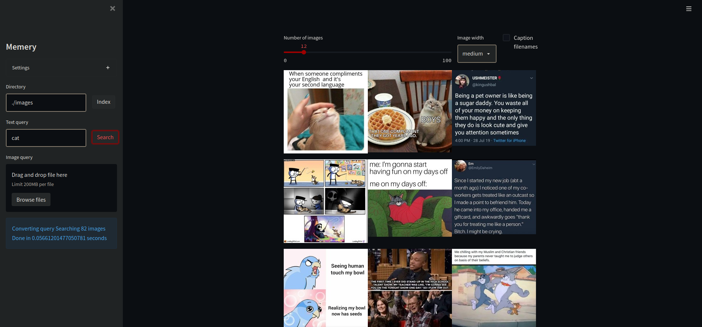
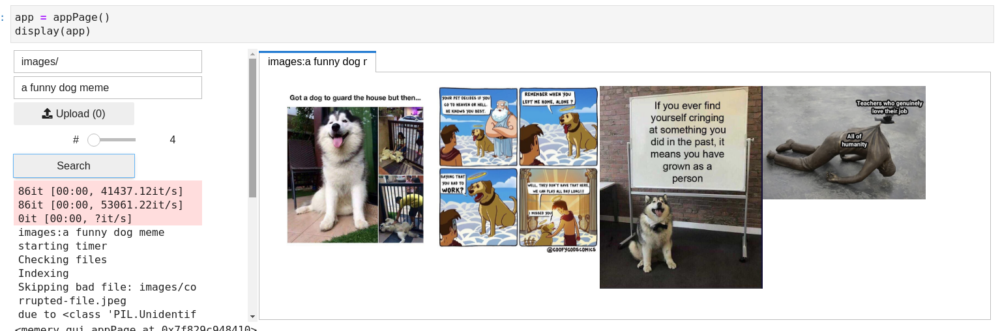

# memery
> Use human language to search your image folders!


The problem: you have a huge folder of images. Memes, screenshots, datasets, product photos, inspo albums, anything. You know that somewhere in that folder is the exact image you want, but you can't remember the filename or what day you saved it. There's nothing you can do but scroll through the folder, skimming hundreds of thumbnails, hoping you don't accidentally miss it, and that you'll recognize it when you do see it. 

Humans do this amazingly well. But even with computers, local image search is still a manual effort - you're still sorting through folders of images, like an archivist of old.

**Now there's Memery**.

The `memery` package provides natural language search over local images. You can use it to search for things like "a line drawing of a woman facing to the left" and get _reasonably good results!_ 

You can do this over thousands of images (it's not optimized for performance yet, but search times scale well under O(n)). 

You can view the images in a browser GUI, or pipe them through command line tools. 

You can use `memery` or its modules in Jupyter notebooks, including GUI functions! 

Under the hood, `memery` makes use of **CLIP**, the [Contrastive Language-Image Pretraining transformer](https://github.com/openai/CLIP), released by OpenAI in 2021. CLIP trains a vision transformer and a language transformer to find the same latent space for images and their captions. This makes it perfect for the purpose of natural language image search. CLIP is a giant achievement, and `memery` stands on its shoulders.

Outline:
- Usage
  - Install locally
  - Use GUI
  - Use CLI
  - Use in Jupyter
  - Use the library
- Development
  - Notebook-driven development
  - Pull the repo
  - Branch and install
  - Notebook-driven development
  - Change the notebooks
  - Test the notebooks
  - Notebook-driven development
  - Tangle the source code
  - Weave the documentation
- Contributing
  - Who works on this project
  - How you can help
  - What we don't do
  - Thanks

## Installation

With Python 3.6 or greater:
`pip install memery`

Currently memery defaults to GPU installation. This will probably be switched in a future version. If you want to run CPU-only, run the following command after installing memery:

`pip install torch==1.7.1+cpu torchvision==0.8.2+cpu torchaudio==0.7.2 -f https://download.pytorch.org/whl/torch_stable.html`

Someday memery will be packaged in an easy to use format, but since this is a Python project it is hard to predict when that day will be.

If you want to help develop memery, you'll need to clone the repo. See below.

## Usage

What's your use case? 

**I have images and want to search them with a GUI app**
   
   ↳  Use the Browser GUI
   
**i have a program/workflow and want to use image search as one part of it**
  
   ↳ Use in Jupyter
   
   ↳ Use as a Python module
   
   ↳ Use from command line or shell scripts
   
**i want to improve on and/or contribute to memery development**
 
   ↳ Start by cloning the repo 

### Use GUI

Currently memery has a rough browser-based GUI. To launch it, run the following in a command line: 

```memery serve```

or set up a desktop shortcut that points to the above command.

Memery will open in a browser window. The interface is pretty straightforward, but it has some quirks.



The sidebar on the left controls the location and query for the search. The "Directory" box requires a full directory path; unfortunately, Streamlit does not yet have a folder-picker component. The path is relative to your current working directory when you run `memery serve`.

The search will run once you enter a text or image query. If you enter both text and image queries, memery will search for the combination.

Beneath these widgets is the output area for temporary messages displayed with each search. Mostly this can be ignored.

The right hand panel displays the images and associated options. Major errors will appear here as giant stack traces; sometimes, changing variables in the other widgets will fix these errors live. If you get a large error here it's helpful to take a screenshot and share it with us in Github Issues.

### Use in Jupyter

If you're in a Jupyter environment, you can summon an ipywidgets GUI directly into an output cell like this:

```python
from memery.gui import appPage

```

```python
app = appPage()
display(app)
```


    <memery.gui.appPage at 0x7f829c87d290>




Unfortunately the widgets won't display without an active runtime, so the above is a screenshot. In a Jupyter environment, the GUI works just like the browser-based GUI. 

Opening new appPage instances in separate cells can be helpful for exploring a dataset, but it can also cause memory overruns. For this reason the Jupyter interface is tabbed and each search will appear in a new tab.

### Use CLI

The memery command line is currently very rudimentary. So far you can use `memery` on any folder and it will search for images recursively, returning a list object to stdout. 

Pass the --n flag to control how many images are returned (default 10).

`memery recall PATH/TO/IMAGE/FOLDER 'query' --n 20`

I'm not clear yet on what behavior command-line users will expect from it. In the future we may want to make it non-recursive by default, and map the behavior more closely to POSIX standards. I would love feedback or help on this.
`

### Use as a library

The function currently called `query_flow` (against all Python convention) accepts a folder name and a query and returns a ranked list of image files. This is also recursive by default, and prints too much information into stdout. And it calls index_flow every time, which can be annoying if you have corrupted files in the directory, as it will need to rebuild the tree-index each time despite the files not changing. This will be solved in a future release.

```python
from memery.core import query_flow
```

```python
ranked = query_flow('./images', 'dad joke')

print(ranked[:5])
```

    89it [00:00, 44503.23it/s]
    89it [00:00, 37660.72it/s]
    0it [00:00, ?it/s]

    starting timer
    Checking files
    Indexing
    Skipping bad file: images/memes/corrupted-file.jpeg
    due to <class 'PIL.UnidentifiedImageError'>
    Skipping bad file: images/memes/.ipynb_checkpoints/corrupted-file-checkpoint.jpeg
    due to <class 'PIL.UnidentifiedImageError'>
    Loaded 82 encodings
    Encoding 0 new images


    0it [00:00, ?it/s]

    Building treemap


    


    Saving 82 encodings
    Converting query
    Searching 82 images
    Done in 0.5853581428527832 seconds
    ['images/memes/Wholesome-Meme-68.jpg', 'images/memes/Wholesome-Meme-74.jpg', 'images/memes/Wholesome-Meme-88.jpg', 'images/memes/Wholesome-Meme-78.jpg', 'images/memes/Wholesome-Meme-23.jpg']


Here's the first result from that list:


So that's how to use memery. Let's look at how you can help make it better.

## Development

Memery is a different beast than most pieces of code you've seen. It's a *literate program*: a program written for human beings to read.

Nothing in this code is particularly special. The algorithms, data structures, and pipeline are either bog-standard or even subpar. The model was developed by OpenAI, and the tree indexer by Spotify. All I did was glue a bunch of disparate things together. The only reason nobody did it before me is that there's no money in it.


### Notebook-driven development

The thing that makes this program interesting is that it was developed *in Jupyter notebooks*. Each component has its code and documentation in the same place, a `.ipynb` notebook.

This is possible thanks to a new-ish project called `nbdev`. It provides literate programming functionality for notebooks. Specifically, it allows the programmer to automatically weave code and tangle documentation from the content of the notebooks!

This means that relevant docs, code and tests for that code all live in the same location. And ideally, that place is a notebook *written for humans*. I'm still getting the hang of this, but it means explaining *why* something works, rather than simply how to do it.

So that's the *why* of notebook-driven development. Let's look at *how* that works in practice.

### Pull the repo

Clone this repository from Github:

`git clone https://github.com/deepfates/memery.git`


### Install dependencies
Enter the `memery` folder and install requirements:

```
cd memery
pip install requirements.txt`
```

Feel free to use a virtual environment manager of your choosing. I ought to do this but I've been lucky too long and it's gone to my head.


### Branch the code

"Small branches, quickly merged" should be the motto here. Another tragic case of "do what I say, not what I do".

For example, in updating the literate documentation for memery I created a branch called `literate`:

`git checkout -b literate`

Within this branch, I can work on different files and subtasks. I can commit several changes in a row, and double check all my tests, before trying to merge with the upstream `main` repo through a pull request.

## Notebook-driven development

To test memery as you work on it, you'll want to install it locally. This is as simple as using `pip` with "editable" enabled:

`pip install -e .`

The `.` refers to your local working directory; if this command doesn't work, try replacing that character with the full path of your memery repo.

Now, within the main memery folder there is a subfolder `memery/memery`. This contains `.py` files, which are the source code for the repo. You might be tempted to edit these Python files directly, but you must hesitate.

Remember: we are doing notebook-driven development. The Python files

Change the notebooks

Test the notebooks

Notebook-driven development

Tangle the source code

Weave the documentation

---

*Compile this notebook*

```python
from nbdev.export import notebook2script; notebook2script()

```

    Converted 00_core.ipynb.
    Converted 01_loader.ipynb.
    Converted 02_crafter.ipynb.
    Converted 03_encoder.ipynb.
    Converted 04_indexer.ipynb.
    Converted 05_ranker.ipynb.
    Converted 06_fileutils.ipynb.
    Converted 07_cli.ipynb.
    Converted 08_jupyter_gui.ipynb.
    Converted 09_streamlit_app.ipynb.
    Converted index.ipynb.

